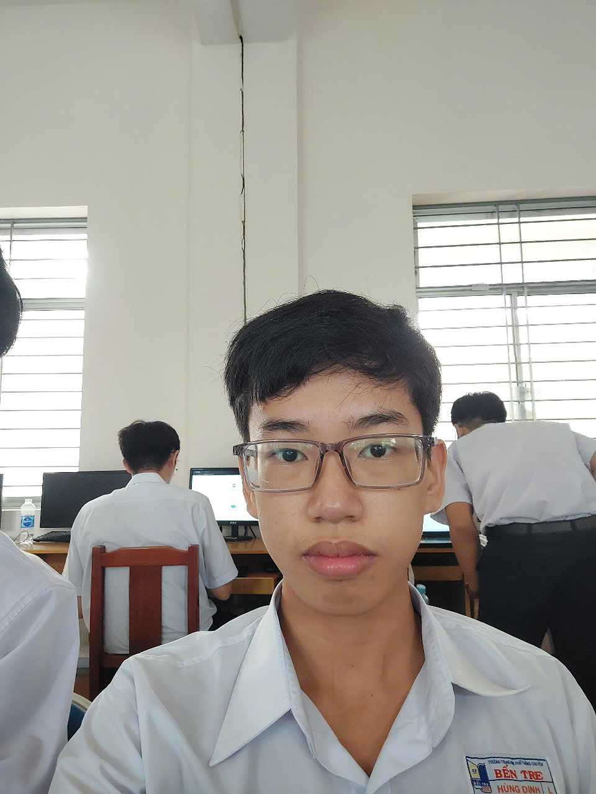

<html lang="vi">
<head>
  <meta charset="UTF-8">
  <meta name="viewport" content="width=device-width, initial-scale=1.0">
  <title>Trang Web Của Tôi</title>
  <link href="https://fonts.googleapis.com/css2?family=Lora&display=swap" rel="stylesheet"> <!-- Thêm link font Lora -->
  
</head>
<body>

  

    <h1 class="floating-text">ĐẶNG HÙNG DINH XIN CHÀO</h1>
  

  

    <!-- Giới thiệu bản thân -->
    

      

        Mình tên là Đặng Hùng Dinh, hiện đang theo học tại ngôi trường THPT Chuyên Bến Tre, mình rất hân hạnh được giới thiệu về bản thân mình.
      

    

    <!-- Thông tin cá nhân -->
    

      

        
      

      

        
Thông tin cá nhân

        

          Hiện tại mình học lớp 12 Lý, trường THPT Chuyên Bến Tre. Mình nặng 55kg và cao 1,70m. Mình là một Madridista đấy nhé và thần tượng của mình là Jude Bellingham.
        

      

    

    <!-- Nguyện vọng tương lai -->
    

      

        
Nguyện vọng tương lai

        

          Mình chọn thi khối Khoa học tự nhiên, nguyện vọng 1 là ngành Sư phạm Đại học Sư Phạm và Đại học Luật.
        

      

      

        
      

    

  

</body>
</html>
